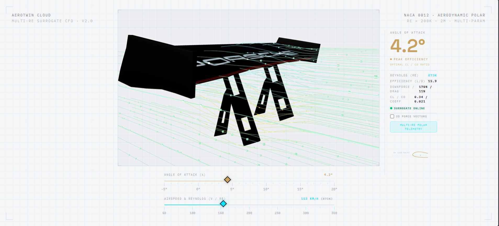
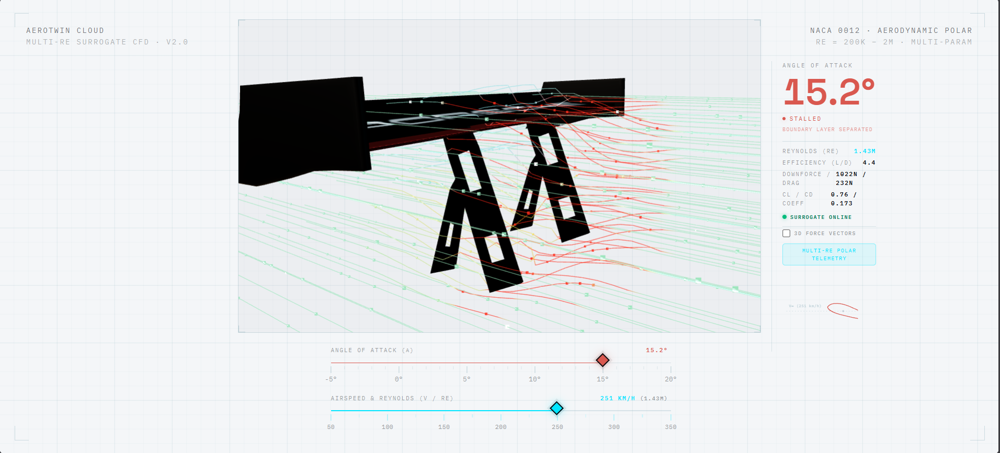

# AeroTwin

AeroTwin is an interactive aerodynamic analysis application for automotive rear wings and spoilers, developed for the final assignment of Summer School 2026 by Siemens Digital Industries Software. It uses a machine-learning surrogate model trained on NACA 0012 aerodynamic polar data to provide instant predictions without running full CFD simulations for every input.

## Screenshots





Replace these image paths with the final screenshots when they are available.

## Features

- Interactive 3D spoiler visualization with animated airflow.
- Angle of attack and vehicle velocity controls.
- Real-time predictions for lift and drag coefficients, downforce, drag, and efficiency.
- Flow-state feedback for linear flow, peak efficiency, near stall, and stall conditions.
- Reynolds-number-aware predictions across multiple operating conditions.
- REST API for health checks, predictions, and aerodynamic performance charts.

## Run Locally

### Option 1: Docker Compose

From the project root:

```bash
docker compose up --build
```

Then open [http://localhost:5173](http://localhost:5173).

### Option 2: Run the services separately

Start the backend:

```bash
cd backend
python -m venv .venv
# Windows
.venv\Scripts\activate
pip install -r requirements.txt
python app.py
```

In a second terminal, start the frontend:

```bash
cd frontend
npm install
npm run dev
```

Then open [http://localhost:5173](http://localhost:5173). The Vite development server forwards API requests to the backend at `http://localhost:5000`.

## API Endpoints

- `GET /api/v1/health` - Reports service and model status.
- `POST /api/v1/predict` - Predicts aerodynamic performance from `angle_of_attack` and `velocity_kmh`.
- `GET /api/v1/chart` - Returns the aerodynamic performance chart.

Example request:

```json
{
  "angle_of_attack": 4.0,
  "velocity_kmh": 200
}
```

## Technology

- **Frontend:** Svelte, TypeScript, Vite, Tailwind CSS, Three.js
- **Backend:** Python, Flask, Flask-CORS
- **Modeling:** scikit-learn, NumPy, pandas
- **Deployment:** Docker, Nginx, and AWS CloudFront, ECS, S3 (for assets)
